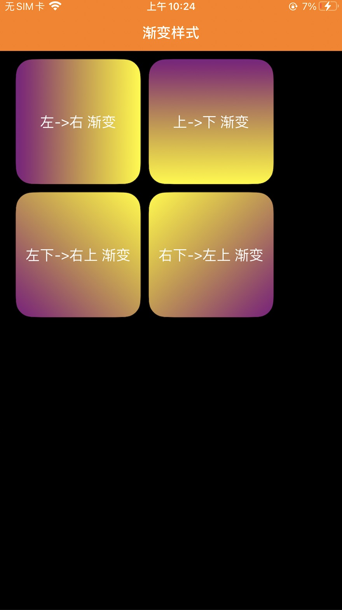
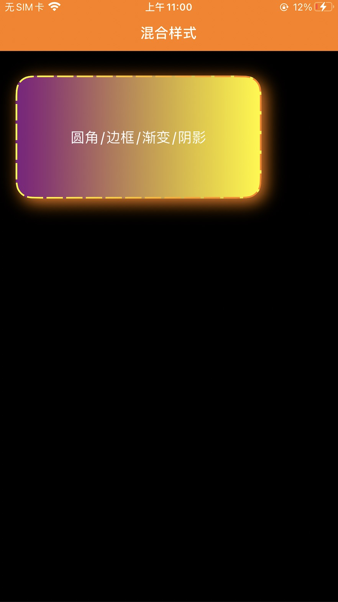
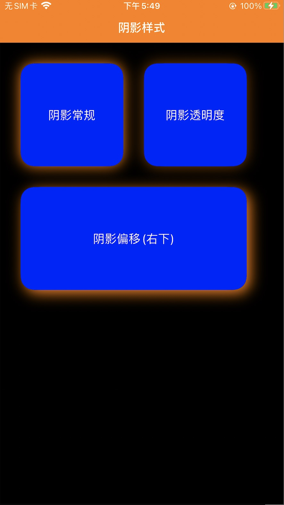
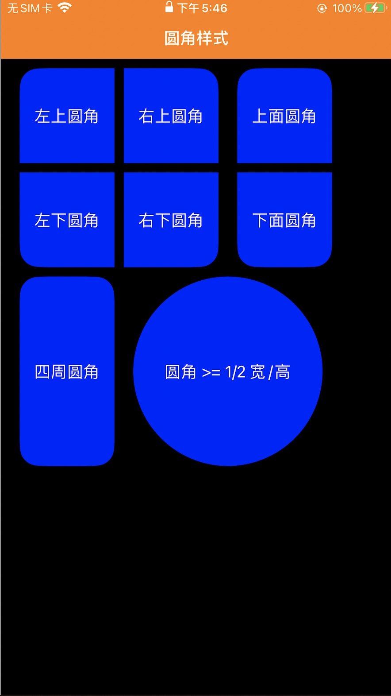
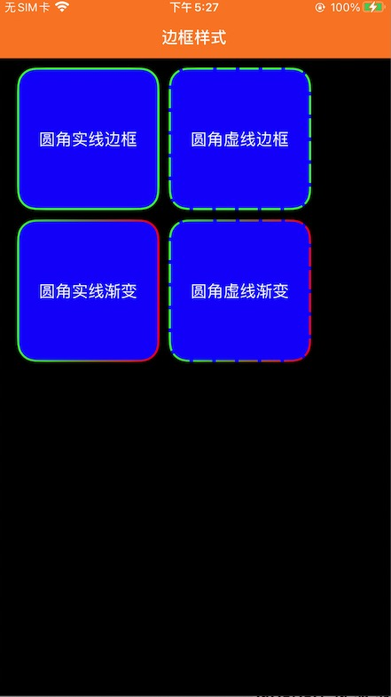

# iOSApp
这是一个使用 MVVM 模式架构的 iOSApp，目的是通过编写一个完整的 App 来探讨学习 iOS 应用开发中常用的一些架构模式，开发方法，常用控件，控件样式自定义，基本动画，自定义View...

一.MVVM 

这里的 MVVM 模式是基于 KVO 特性，实现属性更改监听，通过感知 UIViewController/UIView 生命周期实现资源管理和释放。

- [Y] 使用简单，无侵入
- [Y] 自动管理资源，无须手动释放，不存在内存泄漏
- [Y] 支持点语法
- [Y] 支持 UIView / UIViewController


1.使用简单

```objectivec

///添加 UIViewController 分类
#import "mvvm/UIViewController+ZTMVVM.h"


//某个你需要监听的数据类
_viewModel = [[DemoViewModel alloc]init]

//监听数据变化：更新UI
[self observe:_viewModel notify:^(DemoViewModel *observable, NSString *keyPath) {
    self->_label.text = observable.userData.name;//更新UI
}];

///更新数据
_viewModel.userData.name = @"Ruffian";

```

2.其他接口

```objectivec

//监听所有属性
- (void)observe:(id)observable notify:(void (^)(id observable,NSString *keyPath)) notify;

//设置 需要 监听的属性
- (void)observe:(id)observable keyPaths:(NSArray*)keyPathArray notify:(void (^)(id observable,NSString *keyPath)) notify;

//设置 不需要 监听的属性
- (void)observe:(id)observable keyPathsNot:(NSArray*)keyPathArray notify:(void (^)(id observable,NSString *keyPath)) notify;


//设置 NSKeyValueObservingOptions
- (void)observe:(id)observable options:(NSKeyValueObservingOptions)options notify:(void (^)(id observable,NSString *keyPath)) notify;


//设置 NSKeyValueObservingOptions 和 需要监听的属性
- (void)observe:(id)observable keyPaths:(NSArray*)keyPathArray options:(NSKeyValueObservingOptions)options notify:(void (^)(id observable,NSString *keyPath)) notify;

//设置 NSKeyValueObservingOptions 和 不需要监听的属性
- (void)observe:(id)observable keyPathsNot:(NSArray*)keyPathArray options:(NSKeyValueObservingOptions)options notify:(void (^)(id observable,NSString *keyPath)) notify;

```

3.我认为的使用姿势

```objectivec

-------------UIView/UIViewController-------------
"DemoController.m"

/// 监听数据变化：更新UI
[self observe:_viewModel notify:^(DemoViewModel *observable, NSString *keyPath) {
    ///更新UI
    self->_label.text = observable.userData.name;
}];

/// 通过 ViewModel 管理数据
[_viewModel showUserInfo];

/// 通过 ViewModel 更新数据
[_viewModel updateUserInfo:name];


-------------ViewModel-------------
"DemoViewModel.m"

@property(nonatomic,strong) UserData *userData;//用户数据类

@property(nonatomic,strong) UserModel *userModel;//用户相关 model

///更新数据
- (void)updateUserInfo:(NSString *)name{
    
    ///更新实体类数据
    self.userData.name = name;
}

///获取数据
- (void)showUserInfo{
    self.userData = _userModel.getUserData;
}

-------------Model-------------

"UserModel.m"

///获取用户数据信息
- (UserData *)getUserData{
    UserData *userData = [[UserData alloc]init];
    userData.name = name;
    return userData;
}


"UserData.h"

@interface UserData : NSObject
@property(nonatomic,assign) NSInteger uid;
@property(nonatomic,copy) NSString* name;
@property(nonatomic,strong) NSMutableArray *array;
@property(nonatomic,strong) NSMutableDictionary *dictionary;
@property(nonatomic,strong) UserChild *child;
@end

```

二.ZTUIStyle

这部分内容是为了UI快速开发，为 UIView 及其 子类 提供了一系列关于 UI 样式的快速实现方式，使用方便，实现高效，无侵入
优点：
- [Y] 通过 CALayer 实现，效率高
- [Y] 不依赖 frame ，框架自适应 UIView 大小
- [Y] 支持多种效果同时使用
- [Y] 支持 UIView 及其 所有子类

1.效果图

  
  
  

2.API接口

导入样式分类
```
#import "UIView+ZTUIStyle.h" //导入样式分类
```


圆角
```
/// 圆角
/// @param uiRectCorner UIRectCorner 指定圆角方向（左上，右上，，，全部），可以组合使用
/// @param cornerRadii 圆角大小
- (void)zt_cornerWithUIRectCorner:(UIRectCorner)uiRectCorner withCornerRadiiSize:(CGSize)cornerRadii;

- (void)zt_cornerWithUIRectCorner:(UIRectCorner)uiRectCorner withCornerRadii:(float)cornerRadii;

- (void)zt_cornerWithCornerRadii:(float)cornerRadii;
```
 
边框
```
/// 边框
/// @param borderWidth 边框宽度
/// @param borderColor 边框颜色
/// @param lineDashPhase 虚线起始位置
/// @param lineDashPattern 虚线模型NSNumber数组：奇数位数值表示实线长度，偶数位数值表示空白长度
/// @param gradientColors 边框渐变颜色
/// @param gradientDirection 边框渐变方向
- (void)zt_borderWithBorderWidth:(CGFloat)borderWidth 
                withBorderColor:(UIColor*)borderColor 
                withBorderGradientColors:(nullable NSMutableArray<UIColor*>*)gradientColors 
                withBorderGradientDirection:(GradientDirection) gradientDirection 
                withLineDashPhase:(CGFloat)lineDashPhase 
                withLineDashPattern:(nullable NSArray<NSNumber *> *)lineDashPattern;

- (void)zt_borderWithBorderWidth:(CGFloat)borderWidth 
                withBorderColor:(UIColor*)borderColor 
                withLineDashPhase:(CGFloat)lineDashPhase 
                withLineDashPattern:(NSArray<NSNumber *> *)lineDashPattern;

- (void)zt_borderWithBorderWidth:(CGFloat)borderWidth 
                withBorderColor:(UIColor*)borderColor;

- (void)zt_borderWithBorderWidth:(CGFloat)borderWidth 
                withBorderGradientColors:(NSMutableArray<UIColor*>*)gradientColors 
                withBorderGradientDirection:(GradientDirection) gradientDirection;

- (void)zt_borderWithBorderWidth:(CGFloat)borderWidth 
                withBorderGradientColors:(NSMutableArray<UIColor*>*)gradientColors 
                withBorderGradientDirection:(GradientDirection) gradientDirection 
                withLineDashPhase:(CGFloat)lineDashPhase 
                withLineDashPattern:(NSArray<NSNumber *> *)lineDashPattern;
```

渐变
```
/// 背景渐变
/// @param gradientColors 渐变颜色数组 @[ UIColor , UIColor ]
/// @param direction 渐变方向
/// @param gradientLocations 渐变位置数组
- (void) zt_gradientWithGradientColors:(NSMutableArray<UIColor*>*)gradientColors 
                    withDirection:(GradientDirection)direction 
                    withGradientLocations:(nullable NSArray*)gradientLocations;

- (void) zt_gradientWithGradientColors:(NSMutableArray<UIColor*>*)gradientColors 
                    withDirection:(GradientDirection)direction;
```

阴影
```
/// 阴影
/// @param shadowColor 阴影颜色
/// @param shadowOffset 阴影偏移
/// @param shadowRadius 阴影圆角
/// @param shadowOpacity 阴影透明度
- (void)zt_shadowWithShadowColor:(UIColor*)shadowColor 
                withShadowRadius:(CGFloat)shadowRadius 
                withShadowOpacity:(float)shadowOpacity 
                withShadowOffset:(CGSize)shadowOffset;

- (void)zt_shadowWithShadowColor:(UIColor*)shadowColor 
                withShadowRadius:(CGFloat)shadowRadius 
                withShadowOpacity:(float)shadowOpacity;

- (void)zt_shadowWithShadowColor:(UIColor*)shadowColor 
                withShadowRadius:(CGFloat)shadowRadius;

- (void)zt_shadowWithShadowColor:(UIColor*)shadowColor 
                withShadowRadius:(CGFloat)shadowRadius 
                withShadowOffset:(CGSize)shadowOffset;
```


