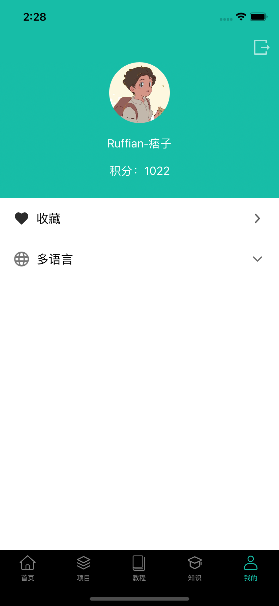

# iOSApp

大体上通过业务模块分包，使用 MVVM （基于 KVO ）模式架构，目标是构建一个扩展性良好的应用，controller 模块编写 view 相关的布局信息，界面业务逻辑在 ViewModel 中实现，数据通过 Model 管理。


### 功能效果图
|  |  |  |
| --- | --- | --- |
|  | |  |
|  |  |  |
|  |  |  |
|  |  |  |


### 项目结构
```
 |--iOSApp
    |-- modules (业务模块：账户模块，文章模块，搜索模块，收藏模块,,,)
    |-- demo (项目相关的demo，快速熟悉某些项目特性：mvvm特性，第三方库特性,,,)
    |-- common (常用工具类，帮助类，分类)
        |-- helper (常用辅助类)
        |-- base (通用基类)
        |-- view (通用自定义View)248
        |-- db (数据库)
        |-- utils (工具类)
        |-- category (常用分类)
        |-- http (网络)
    |-- mvvm (mvvm框架)
    |-- AppDelatege
    |-- Assets.xcassets (默认图片/图标)
    |-- Info.plist
    |-- PrefixHeader.pch
    |-- Localizable.strings (国际化文本)
    |-- zh-Hans_image.bundle （国际化图片：繁体）
```

### 业务模块结构
```
|--modules
    |-- article (文章模块)
    |-- search (搜索模块)
    |-- collect (收藏模块)
    |-- ...... (其他模块)
    |-- account (账户模块)
         |-- model (数据管理model，实体类data)
              |-- AccountModel (登录，注册，用户本地数据)
              |-- UserData (用户实体) 
         |-- controller 
              |-- LoginController  
              |-- RegisterController
         |-- viewModel
              |-- LoginViewModel  
              |-- RegisterViewModel 
         |-- view (此模块相关的自定义View)
    
```

### 技术概览

- AFNetworking ： 网络数据请求
- FMDB ： 本地数据库管理
- SDWebImage ： 图片加载
- MJExtension ： 数据转换/解析
- MJRefresh ： 下拉刷新/上拉加载
- Masonry ： 自动布局框架
- MBProgressHUD ： 吐司/Loading
- ZTUIStyle ： UI效果（圆角/边框/渐变/阴影）
- ZTMVVM ： mvvm

### 附加产物

#### 1.ZTMVVM
        
基于 KVO 特性，实现属性更改监听，通过数据变更驱动UI变化，通过感知 UIViewController/UIView 生命周期实现资源管理和释放。

优点：
- [Y] 使用简单，无侵入
- [Y] 自动管理资源，无须手动释放，不存在内存泄漏
- [Y] 支持点语法
- [Y] 支持 UIView / UIViewController

[ZTMVVM 文档](https://github.com/RuffianZhong/iOSApp/blob/master/README_mvvm.md)

#### 2.ZTUIStyle

UI 快速开发，高效实现精美 UI 样式：圆角，边框，阴影，渐变...  >>>> [ZTUIStyle](https://github.com/RuffianZhong/ZTUIStyle)

优点：
- [Y] 通过 CALayer 实现，效率高
- [Y] 不依赖 frame ，框架自适应 UIView 大小
- [Y] 支持多种效果同时使用
- [Y] 支持 UIView 及其 所有子类

